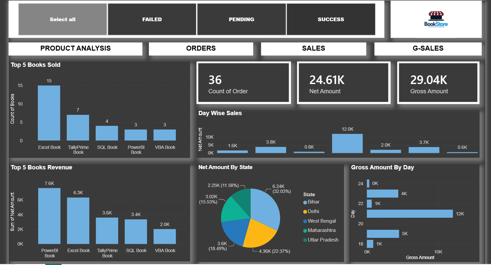

# 📊 BookStore Sales Dashboard | Power BI

## 📌 Project Overview

An interactive BookStore Sales Dashboard created using Microsoft Power BI to analyze orders, sales, books, products, and regional performance.

## 🛠️ Tools & Skills

- Power BI
- Power Query
- DAX
- Data Cleaning
- Data Modeling
- Data Visualization
- Dashboard Development

## 📊 Key KPIs

- Total Orders: 36
- Net Amount: 24.61K
- Gross Amount: 29.04K

## 📈 Dashboard Analysis

- Top 5 Books Sold
- Top 5 Books Revenue
- Day-wise Sales
- Net Amount by State
- Gross Amount by Day
- Order Status Analysis
- Product Analysis
- Sales Performance

## 🎯 Key Features

- Interactive filters
- KPI Cards
- DAX Measures
- Data Modeling
- State-wise Analysis
- Product-wise Analysis
- Book Revenue Analysis
- Interactive Power BI Visualizations

## 🖼️ Dashboard Preview

## 📁 Project File

The complete Power BI `.pbix` file is available in this repository.

## 👤 Author

**Suraj Kumar**

Aspiring Data Analyst | Power BI | Power Query | Excel | Data Cleaning | Dashboard Development
